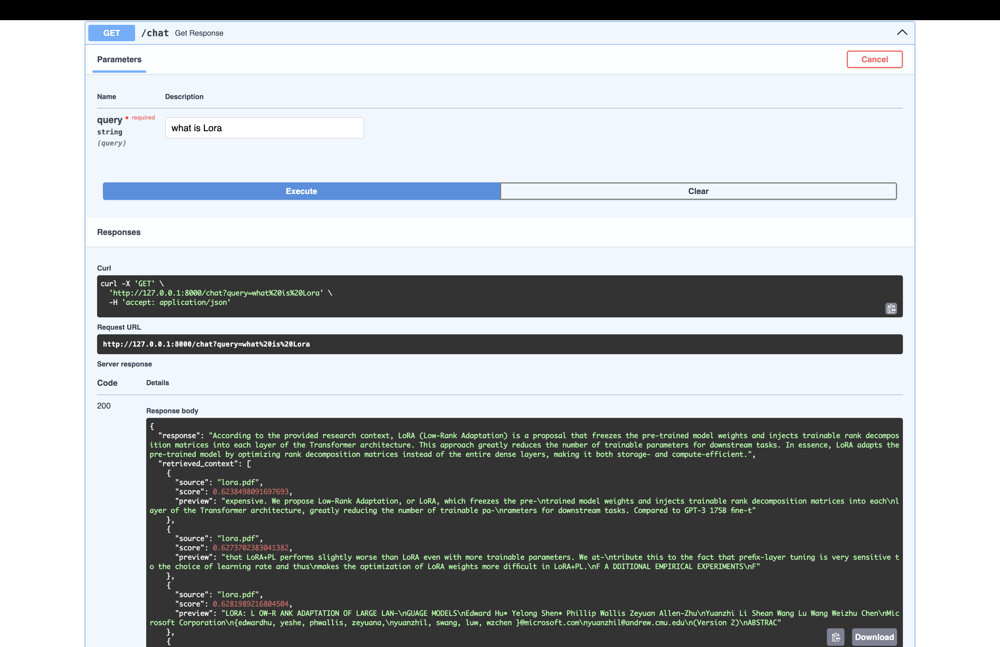

# CortexRAG

A local RAG pipeline for chatting with research papers. I built this with FastAPI, Llama 3, and ChromaDB specifically to figure out why out-of-the-box semantic search usually sucks for dense technical documents, and how to fix it.

Focused heavily on retrieval quality, semantic search behavior, grounding reliability, and retrieval debugging workflows for research-oriented RAG systems.

---

## Demo

### API Response Example



---

## Features

- Research paper ingestion pipeline
- Semantic vector search using ChromaDB
- HuggingFace embedding models
- Multi-query retrieval system
- Context-aware query expansion using local LLMs
- Retrieval metadata with source tracking
- FastAPI backend for API serving
- Local LLM inference using Ollama
- Persistent vector database storage

---

## Architecture

```text
User Query
↓
Query Expansion
↓
Semantic Retrieval
↓
Context Aggregation & Deduplication
↓
Grounded LLM Response Generation
↓
FastAPI API Response
```

---
##Tech Stack
Vector DB: ChromaDB & HuggingFace Embeddings (kept local for fast iteration).

LLM Generation: Ollama (Llama 3) to prevent API costs from blowing up during testing.

Backend: FastAPI to serve the retrieval and chat endpoints.

Orchestration: LangChain for multi-query expansion and context formatting

## Project Structure

```bash
backend/
    app.py

source/
    dataloader.py
    splitter.py
    vectordb.py
    retriever.py
    query_expansion.py
    rag_chain.py

data/
    research papers

vector_store/
    persisted embeddings

ingest.py
```

---
## Retrieval Evaluation

CortexRAG includes a lightweight retrieval evaluation framework for benchmarking semantic retrieval quality across technical research queries.
(Benchmarked on 400/80)
### Current Benchmark Results

| Metric | Score |
|---|---|
| Top-1 Retrieval Accuracy | 75% |
| Top-3 Coverage Accuracy | 75% |
| Average Retrieval Score | 0.5679 |
| Total Indexed Chunks | 2320 |

## Chunking Strategy Experiments

Different chunking configurations were evaluated using the retrieval benchmark framework.

| Chunk Size | Overlap | Top-1 Accuracy | Top-3 Coverage | Avg Retrieval Score |
|---|---|---|---|---|
| 400 | 80 | 75% | 75% | 0.5679 |
| 550 | 90 | 100% | 100% | 0.5714 |
| 600 | 100 | 100% | 100% | 0.5396 |
| 700 | 120 | 100% | 100% | 0.5981 |


### Evaluation Framework

The evaluation pipeline benchmarks:

- Top-1 retrieval accuracy
- Top-3 retrieval coverage
- Average retrieval similarity score
- Multi-document retrieval behavior

The framework was used to compare:
- chunking strategies
- overlap sizes
- query expansion behavior
- retrieval filtering logic


## The Hard Parts & What i  Learned
Building this made me realize that vector databases aren't magic. 90% of making RAG work isn't the LLM—it's writing good filtering logic and tuning your chunk sizes. Here are the main issues I ran into and fixed:

Acronyms break vector search: Asking "What is LoRA?" kept failing because the embedding for "LoRA" doesn't map cleanly to chunks explaining "Low-Rank Adaptation". I implemented an LLM-powered query expansion step to spell out acronyms before hitting ChromaDB.

Comparison questions are a nightmare: Asking the system to "Differentiate between LoRA and BERT" usually failed because no single text chunk contains both. I had to build a multi-query retrieval system to fetch chunks for both concepts independently and aggregate them.

Chunking tradeoffs: After benchmarking, 600 tokens with a 100-token overlap was the sweet spot. Anything smaller lost context, and anything bigger pulled in way too much noise that hallucinated the LLM.

Semantic drift during expansion: Sometimes the query expansion step would hallucinate technical terminology before the search even started. I had to strictly constrain the expansion prompt to prevent semantic drift.


## Setup

### Clone Repository

```bash
git clone https://github.com/ritugupta8898-cloud/CortexRAG.git
cd CortexRAG
```

### Create Virtual Environment

```bash
python3 -m venv venv
source venv/bin/activate
```

### Install Dependencies

```bash
pip install -r requirements.txt
```

### Run Ingestion

```bash
python3 ingest.py
```

### Start Backend

```bash
uvicorn backend.app:app --reload
```

---

## API Endpoint

### Chat Endpoint

```bash
GET /chat?query=your_query
```

Example:

```bash
http://127.0.0.1:8000/chat?query=What is LoRA?
```

---

## Example Retrieval Metadata

The API exposes:

- Retrieved source documents
- Similarity scores
- Chunk previews

to help analyze retrieval quality and grounding behavior.

---


## Example Use Cases

- Research paper semantic search
- AI research assistant
- Knowledge retrieval systems
- Context-aware QA systems
- NLP experimentation
- Retrieval engineering experimentation
```